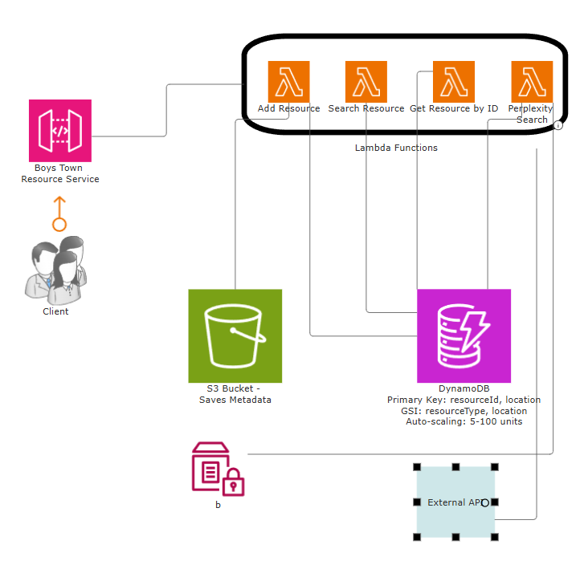

# Boys Town Resource Center API

A serverless application built with AWS CDK to manage and search for support resources for Boys Town. This API provides endpoints for storing, retrieving, and searching for support resources, as well as integrating with Perplexity AI to find external resources.



## Features

- **Resource Management**: Add, retrieve, and search for support resources
- **External Resource Discovery**: Find external support resources using Perplexity AI
- **Resource Filtering**: Filter resources by type, location, and availability
- **Serverless Architecture**: Built using AWS Lambda, DynamoDB, and API Gateway
- **Auto Scaling**: DynamoDB tables automatically scale based on demand

## Architecture

This project uses the following AWS services:

- **AWS Lambda**: Serverless compute for API endpoints
- **Amazon DynamoDB**: NoSQL database for storing resource information
- **Amazon API Gateway**: REST API interface
- **Amazon S3**: Storage for resource metadata
- **AWS Parameter Store**: Secure storage for API keys
- **AWS IAM**: Identity and access management for secure service interactions

## API Endpoints

| Method | Endpoint | Description |
|--------|----------|-------------|
| POST | /resources | Add a new resource |
| GET | /resources | Search for resources by type and location |
| GET | /resources/{resourceId} | Get a specific resource by ID |
| GET | /external-search | Search for external resources using Perplexity AI |

## Getting Started

### Prerequisites

- Node.js (v14.x or later)
- AWS CLI configured with appropriate credentials
- AWS CDK installed (`npm install -g aws-cdk`)

### Installation

1. Clone the repository:
   ```bash
   git clone <repository-url>
   cd cic-boystown-project
   ```

2. Install dependencies:
   ```bash
   npm install
   ```

3. Store the Perplexity API key in AWS Parameter Store:
   ```bash
   aws ssm put-parameter --name "/cic/perplexity-api-key" --value "your-perplexity-api-key" --type "SecureString" --overwrite
   ```

4. Deploy the stack:
   ```bash
   cdk deploy
   ```

## Usage Examples

### Add a Resource

```bash
curl -X POST \
  -H "Content-Type: application/json" \
  -d '{
    "resourceType": "alcohol_support",
    "location": "Chandler, AZ",
    "name": "Recovery Center",
    "address": "123 Main St, Chandler, AZ 85225",
    "phoneNumber": "480-555-1234",
    "hours": "Monday-Friday 9am-5pm",
    "website": "https://example.com/recovery"
  }' \
  https://YOUR_API_URL/prod/resources
```

### Search for Resources

```bash
curl "https://YOUR_API_URL/prod/resources?resourceType=alcohol_support&location=Chandler"
```

### Find External Resources

```bash
curl "https://YOUR_API_URL/prod/external-search?resourceType=mental_health&location=Phoenix,%20AZ"
```

## Development

### Project Structure

- **`/bin`**: Application entry point
- **`/lib`**: CDK stack definition
- **`/lambda`**: Lambda function code
  - **`/add-resource`**: Lambda for adding resources
  - **`/get-resource-by-id`**: Lambda for retrieving resources by ID
  - **`/search-resources`**: Lambda for searching resources
  - **`/perplexity-search`**: Lambda for searching external resources via Perplexity AI
- **`/test`**: Unit tests for the CDK stack

### Useful Commands

* `npm run build`   compile TypeScript to JavaScript
* `npm run watch`   watch for changes and compile
* `npm run test`    perform the Jest unit tests
* `npx cdk deploy`  deploy this stack to your default AWS account/region
* `npx cdk diff`    compare deployed stack with current state
* `npx cdk synth`   emits the synthesized CloudFormation template

## Testing

Run the unit tests with:
```bash
npm run test
```

## Future Enhancements

- Add authentication and authorization
- Implement resource ratings and reviews
- Create a web interface for resource management
- Add support for multiple languages
- Implement resource verification workflow

## License

[MIT](LICENSE)
